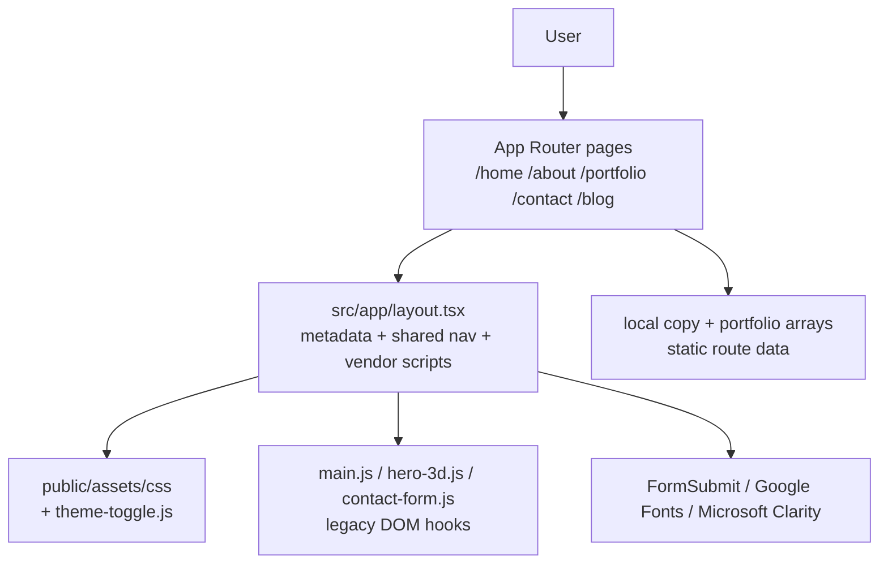

# Architecture Spine — sahamali.dev

## Design Paradigm

The site follows a static-export, route-oriented front-end shell: the App Router renders individual pages as static content, a single shared layout provides metadata and browser-level wiring, and the legacy HTML-era CSS/JS layer remains compatible with the DOM contracts that the original portfolio relied on.

## Invariants & Rules

### AD-1 — Static-export route composition

- **Binds:** all routes under `src/app`, including home, portfolio, blog, contact, privacy, terms
- **Prevents:** framework drift toward SSR-only or database-backed assumptions, inconsistent route behavior across pages
- **Rule:** Every route must stay compatible with the static-export build (`next.config.ts` -> `output: "export"`); do not introduce server-only APIs, persistent runtime state, or database-backed page rendering without a new architecture decision.

### AD-2 — Shared shell and asset compatibility

- **Binds:** `src/app/layout.tsx`, `public/assets/css/*`, `public/assets/js/*`, global navigation, theme toggles, and page-level script hooks
- **Prevents:** broken theme switching, navigation controls, gallery initialization, form hooks, and page-specific script bootstrapping
- **Rule:** The root layout remains the single shell for metadata, global CSS/JS imports, navigation markup, and vendor script registration. Any DOM IDs, classes, or element contracts consumed by legacy scripts must remain stable across routes and updates.

### AD-3 — Content is local and page-owned

- **Binds:** portfolio, about, blog, home, legal pages, and all static copy content
- **Prevents:** hidden dependency on backend services, duplicated content definitions, and untracked cross-route content drift
- **Rule:** Page copy, portfolio content, and marketing data stay local to the route or a small shared data module; do not introduce a CMS or query layer unless the project explicitly expands beyond this static site model.

### AD-4 — Browser-only integrations stay externalized

- **Binds:** AOS, Typed.js, GLightbox, Swiper, Purecounter, theme persistence, FormSubmit contact submission, and site analytics hooks
- **Prevents:** hydration mismatches, script-order failures, and document-global initialization crashes in the static export runtime
- **Rule:** Browser integrations must initialize after hydration or in response to DOM readiness, must safely guard `window` / `document`, and must not assume server-side execution.

## Consistency Conventions

| Concern | Convention |
| --- | --- |
| Naming (entities, files, interfaces, events) | Route folders map directly to URLs; page components use descriptive names; shared layout/content hooks keep legacy page IDs stable for compatibility with existing scripts. |
| Data & formats (ids, dates, error shapes, envelopes) | Static content remains as local strings/arrays; route metadata uses `Metadata` exports; contact form submission is delegated to external email service rather than a custom backend API. |
| State & cross-cutting (mutation, errors, logging, config, auth) | Theme preference persists in `localStorage`; user-facing page state remains lightweight and browser-scoped; no app-level auth or server-side session management exists in this feature scope. |

## Stack

| Name | Version |
| --- | --- |
| Next.js | 16.3.4 |
| React | 19.2.8 |
| React DOM | 19.2.8 |
| TypeScript | 5.x |
| Tailwind CSS | 4.x |
| static export mode | `output: "export"` |

## Structural Seed

```text
sahamofficial.github.io/
  src/app/
    layout.tsx              # shared metadata, nav, theme, vendor CSS/JS
    page.tsx                # home/hero and landing content
    about/page.tsx
    portfolio/page.tsx
    contact/page.tsx
    blog/page.tsx
    blog/*/page.tsx         # article routes
    privacy-policy/page.tsx
    terms/page.tsx
  public/assets/
    css/                    # theme and layout CSS
    js/                     # legacy DOM-driven scripts
    img/                    # portfolio images and profile assets
    vendor/                 # third-party bundles
  next.config.ts            # static export configuration
  package.json              # pinned runtime and tooling versions
```



## Capability → Architecture Map

| Capability / Area | Lives in | Governed by |
| --- | --- | --- |
| Home landing and bio | `src/app/page.tsx` | AD-1, AD-2, AD-3 |
| About and resume sections | `src/app/about/page.tsx` | AD-1, AD-3 |
| Portfolio gallery | `src/app/portfolio/page.tsx` | AD-1, AD-3 |
| Contact and enquiry flow | `src/app/contact/page.tsx` | AD-2, AD-4 |
| Blog content pages | `src/app/blog/**/page.tsx` | AD-1, AD-3 |
| Theme system | `src/app/layout.tsx` + `public/assets/css/*` | AD-2, AD-4 |
| Site navigation and shell | `src/app/layout.tsx` | AD-2 |

## Deferred

- Dynamic CMS or admin-managed content model for blog/portfolio updates
- Database-backed persistence for leads, submissions, analytics, or user accounts
- Authentication, authoring workflows, or multi-user editorial tooling
- A separate backend API layer if the site evolves beyond a static marketing + portfolio deployment
